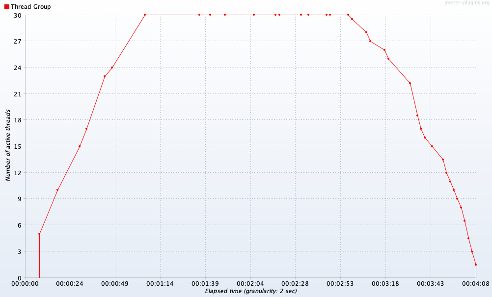
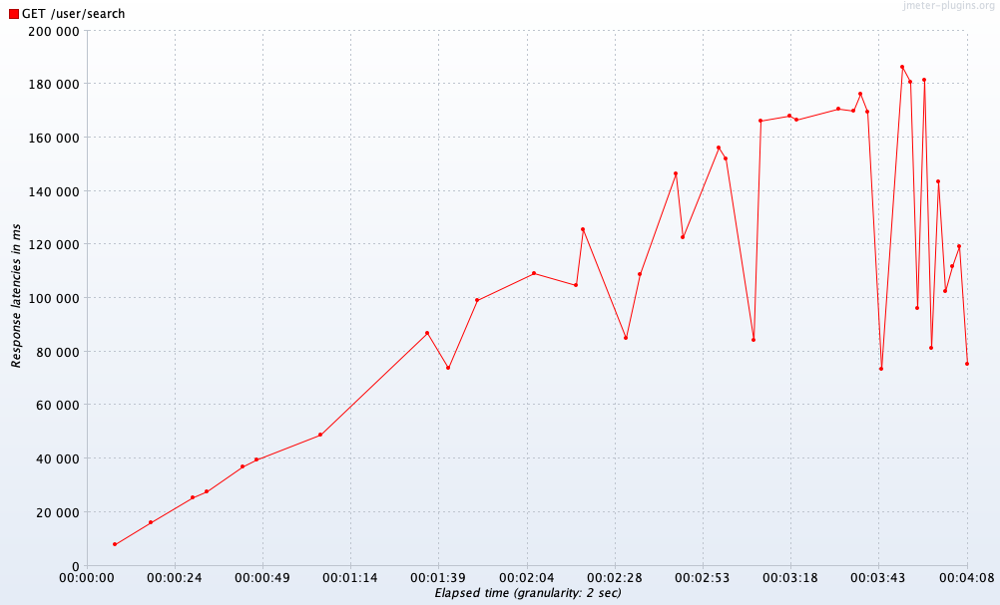
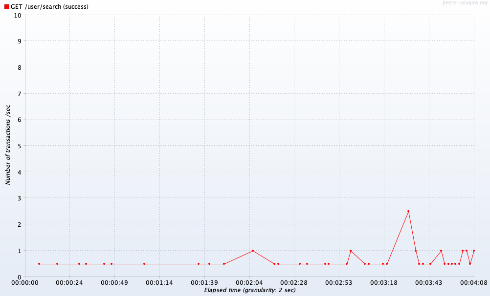
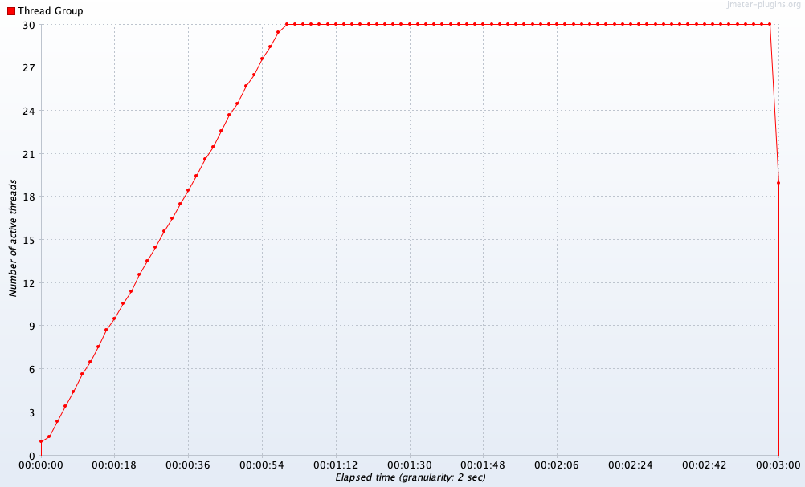
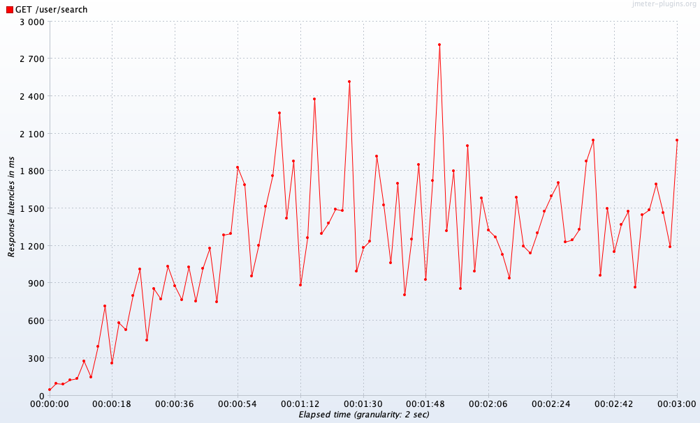
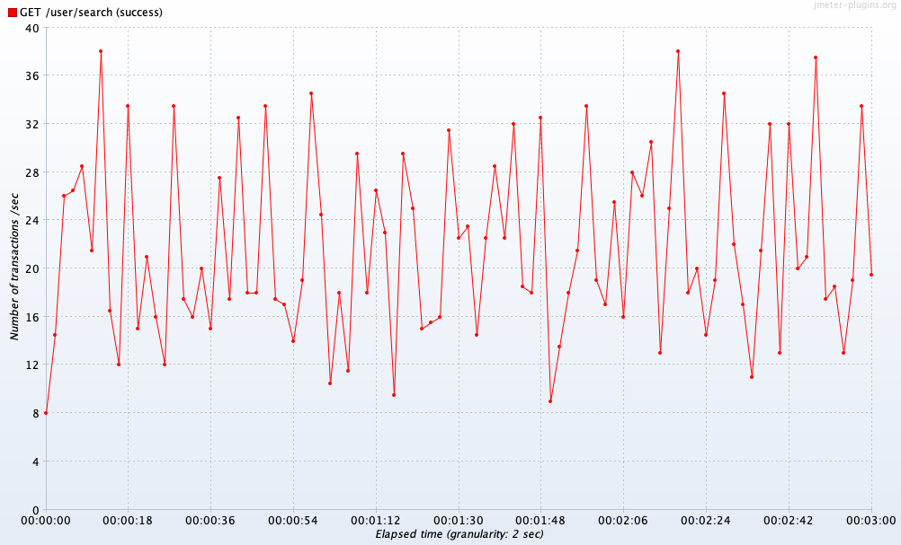

# Отчёт по второй домашней работе
## Результаты нагрузочного тестирования метода поиска анкет по префиксу имени и фамилии

### Без индекса
Количество потоков

Latency

Throughput


### С индексом
Количество потоков

Latency

Throughput


## Запрос добавления индекса
create index first_name_btree_indx on sc."user" USING btree (first_name text_pattern_ops);
create index second_name_btree_indx on sc."user" USING btree (second_name text_pattern_ops);

## Результат EXPLAIN
```
explain ANALYSE SELECT * FROM sc."user" where first_name like 'Иг%' and second_name like 'И%' ORDER BY id;
```
```
Sort  (cost=8.46..8.47 rows=2 width=715) (actual time=2.649..2.655 rows=130 loops=1)
  Sort Key: id
  Sort Method: quicksort  Memory: 54kB
  ->  Index Scan using first_name_btree_indx on ""user""  (cost=0.42..8.45 rows=2 width=715) (actual time=0.527..2.556 rows=130 loops=1)"
    Index Cond: (((first_name)::text ~>=~ 'Иг'::text) AND ((first_name)::text ~<~ 'Ид'::text))
    Filter: (((first_name)::text ~~ 'Иг%'::text) AND ((second_name)::text ~~ 'И%'::text))
    Rows Removed by Filter: 3301
Planning Time: 0.209 ms
Execution Time: 2.695 ms
```

## Решено выбрать индекс b-tree, так как он наиболее всего подходит под текущую задачу и хорошо справляется с поиском по префиксу. 
