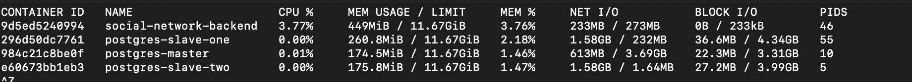

# Отчёт по третьей домашней работе
### Описание/Пошаговая инструкция выполнения домашнего задания:
1. Настраиваем асинхронную репликацию.
2. Выбираем 2 запроса на чтение (/user/get/{id} и /user/search из спецификации) и переносим их на чтение со слейва.
3. Делаем нагрузочный тест по методам (/user/get/{id} и /user/search из спецификации), которые перевели на слейв до и после репликации. Замеряем нагрузку мастера (CPU, la, disc usage, memory usage).
4. Настроить 2 слейва и 1 мастер.
5. Включить потоковую репликацию.
6. (Опционально) воспользоваться одним из кластерных расширения Postgres (например patroni).
7. Настроить кворумную синхронную репликацию.
8. Создать нагрузку на запись в любую тестовую таблицу. На стороне, которой нагружаем считать, сколько строк мы успешно записали.
9. Убиваум одну из реплик (kill -9, docker stop)
10. Заканчиваем нагрузку на запись.
11. Выбираем самый свежий слейв. Промоутим его до мастера. Переключаем на него второй слейв.
12. Проверяем, есть ли потери транзакций.

### Форма сдачи ДЗ
1. Предоставить ссылку на исходный код (github, gitlab, etc)
2. Предоставить докеризированное приложение, которое можно запустить при помощи docker-compose (может лежать рядом с исходным кодом) ИЛИ развернутое приложение, доступное извне ИЛИ инструкция по запуску
3. Предоставить отчет в свободной форме о проделанное работе

### Критерии оценки:
Оценка происходит по принципу зачет/незачет.
Требования:
1. В отчете корректно описано, как настроена репликация.
2. 2 запроса переведено на чтение со слейва.
3. Нагрузочное тестирование показало, что нагрузка перешла на слейв.
4. Проведен эксперимент по потере и непотере транзакций при аварийной остановке master.

## Выполнение домашней работы
### Чтение со слейва
Кластер Postgres настроен на ассинхронную репликацию, в базе 1 млн. пользователей.
Без запуска методов

Запуск методов /user/get/{id} и /user/search, чтение настроено на master. Результат

Запуск методов /user/get/{id} и /user/search, чтение настроено на slave. Результат

### Запись на мастер
Кластер Postgres настроен на синхронную репликацию, в базе 1 млн. пользователей.
Запускаю через jmeter вызов метода создания постов. Останавливаю мастер, по итогу в базе 191554 записей, столько успешных сэмплов и в psotgres.
По итогу можно сделать вывод, что потери транзакций не было.